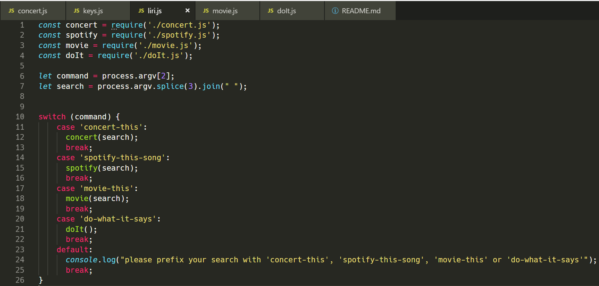
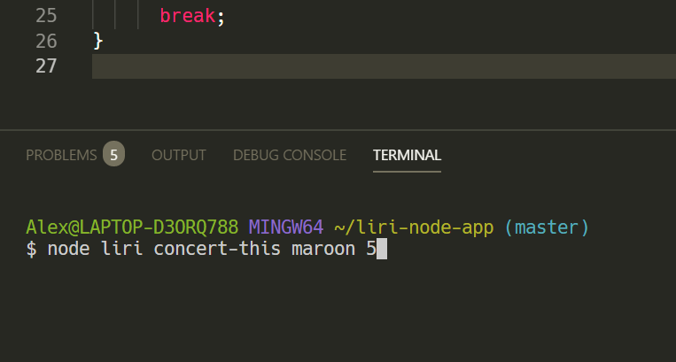
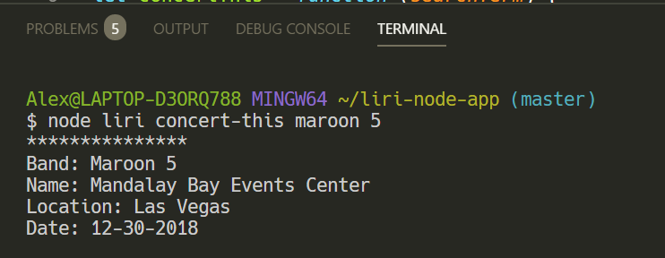
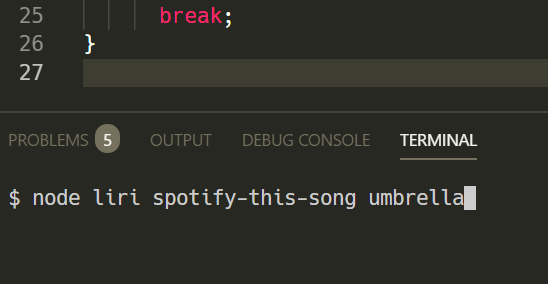
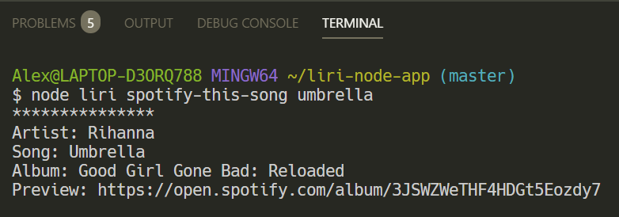
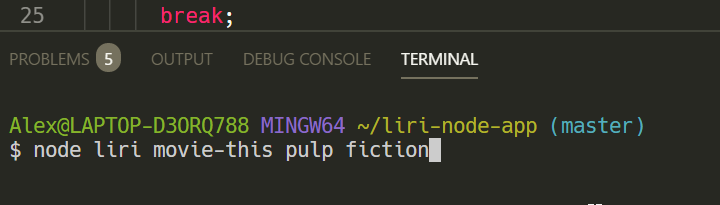
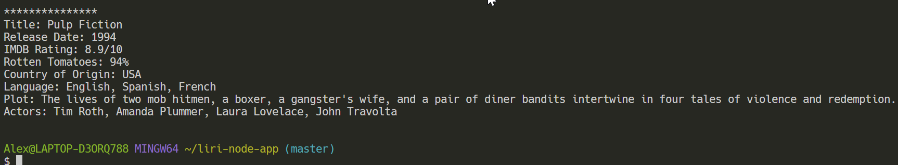
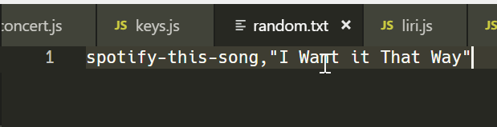
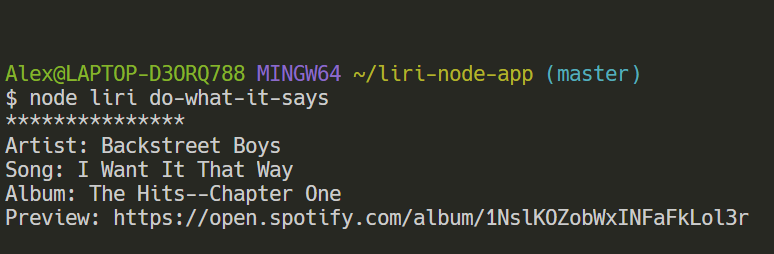
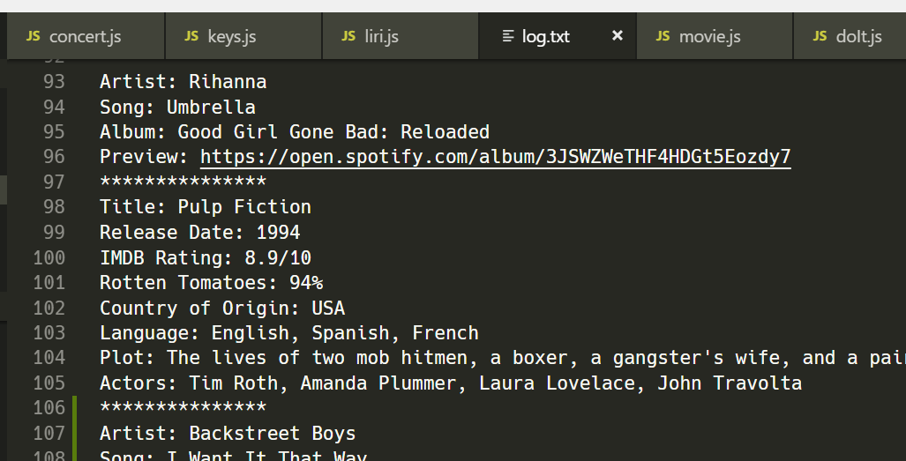

# liri-node-app

The purpose of this tool is to call various APIs and return their objects via the command line. A user can:
    *Find concerts for a particular band or artist via the bandsintown API
    *Find specific song details via the Spotify API
    *Find specific movie details via the OMDB API

## Let's take a look at how it works.

### liri.js

The liri.js file seen below acts as the central hub for the entire application.

*In the command prompt*, a user of the liri tool starts by choosing one of the following commands and pairing it with a relevant search term:
    * 'concert-this' (band or artist)
        * *Ex: node liri.js concert-this maroon 5*
    * 'spotify-this-song' (song)
        * *Ex: node liri.js spotify-this-song umbrella*
    * 'movie-this' (movie)
        * *Ex: node liri.js movie-this pulp fiction*
    * 'do-what-it-says' (uses stored text in a random.txt file)
        * *Ex: node liri.js do-what-it-says*

#### Concerts
Suppose we wanted to find information about Maroon 5's next concert stop.

Enter the following into your terminal (*make sure to double check your location*)

When we hit enter, we should see some details returned to our console:

#### Songs
Suppose we wanted to find information about that "Umbrella" song we can't get out of our head.

Enter the following into your terminal (*make sure to double check your location*)

And the result: (*Control + Click on the Preview URL to go directly to the artist's page*)

#### Movies

What year did 'Pulp Fiction' come out?

Enter the following into your terminal (*make sure to double check your location*)

Result:

#### "do-what-it-says"

This feature isn't really practical for a user but was an assignment requirement. 
Inputting "node liri do-what-it-says" into the command line will read a random.txt file, split the array, and run the Spotify function based on the song in the file. Example:

Contents of the random.txt file:

Result of inputting "node liri do-what-it-says":

#### Bonus feature

All searches get logged to a log.txt file:

### ENJOY!